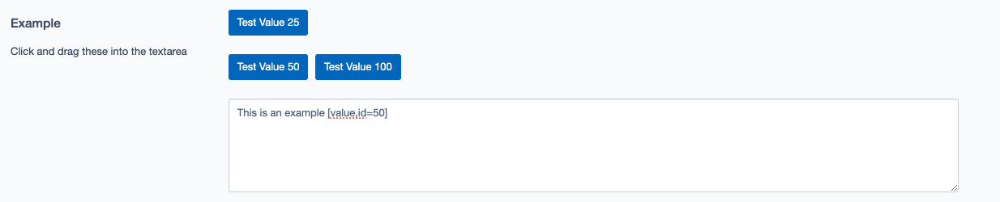

# Silverstripe Droppable

Provides a field that allows for clicking and dragging of shortcodes into a textarea

## Installation (with composer)

	composer require iliain/silverstripe-droppable

## Requirements

* PHP 7.4+ or 8.0+
* Silverstripe 4+ or 5+

## Usage

The following is an example of creating the textarea, assigning buttons to the different rows, and pushing a button to an existing row. 

```PHP
use Iliain\Droppable\Fields\DroppableTextareaField;

$droppable = DroppableTextareaField::create('Example', 'Example', 'This is an example')
    ->setRows(5)
    ->setButtonRow(0, [
        [
            'Value' => '25', 
            'Label' => 'Test Value 25'
        ]
    ])
    ->setButtonRow(1, [
        [
            'Value' => '50', 
            'Label' => 'Test Value 50'
        ]
    ])
    ->pushButton(1, [
        'Value' => '100', 
        'Label' => 'Test Value 100'
    ]);
```



From here, the user can either:
 * Click on a button to insert the shortcode into the end of the textarea
 * Click and drag a button into the textarea to insert the shortcode at the cursor position

## License

See the [License](LICENSE).