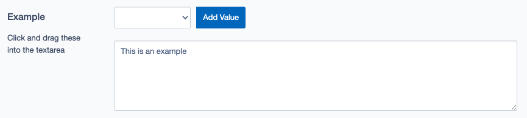

# Silverstripe Droppable Textarea

[](https://packagist.org/packages/iliain/silverstripe-droppable) [](https://packagist.org/packages/iliain/silverstripe-droppable) [](https://packagist.org/packages/iliain/silverstripe-droppable) [](https://packagist.org/packages/iliain/silverstripe-droppable) [](https://packagist.org/packages/iliain/silverstripe-droppable)

Provides a field that allows for clicking and dragging of shortcodes into a textarea. Useful for inserting shortcodes into a textarea without having to type them out.

NOTE: This only allows the insertion of shortcodes, it does not provide any functionality for parsing the shortcodes themselves.

## Installation (with composer)

	composer require iliain/silverstripe-droppable

## Requirements

* PHP 7.4+ or 8.0+
* Silverstripe 4+ or 5+

## Usage

The following is an example of creating the textarea, assigning buttons to the different rows, and pushing a button to an existing row. 

```PHP
use Iliain\Droppable\Fields\DroppableTextareaField;

$droppable = DroppableTextareaField::create('Example', 'Example', 'This is an example')
    ->setRows(5)
    ->setButtonRow(0, [
        '[value,id=25]' => 'Test Value 25',
    ])
    ->setButtonRow(1, [
        '[value,id=50]' => 'Test Value 50',
    ])
    ->pushButton(1, [
        '[value,id=100]' => 'Test Value 100',
    ])
```


You can also use the method `->setUseDropdown(true)` to use a dropdown instead of buttons. This will use the same data as the buttons, but will be displayed in a dropdown instead. This is useful when dealing with large amounts of buttons.



From here, the user can either:
 * Click on a button to insert the shortcode into the start of the textarea, or the current position if the field is currently selected
 * Drag a button into the textarea to insert the shortcode at the cursor position

## Functions

Has the usual functions available to a TextareaField, plus:

* `setButtonRow(int $row, array $buttons)` - Sets the buttons for a particular row. The array of buttons will use the key as the shortcode, and the value as the button text.

* `pushButton(int $row, array $buttons)` - Pushes one or more buttons to the end of a particular row. Uses array_merge, duplicate keys will be overwritten.

* `setUseDropdown(bool $useDropdown)` - Sets whether to use a dropdown instead of rows of buttons. Defaults to false. The dropdown will use the row order as the order of the dropdown items.

* `setLeftDescription(string $description)` - Sets the description to the left of the textarea that appears under the title. Defaults to null.

## TODO

* Minify the JS and CSS
* Allow setting of default dropdown text
* Add gif examples to readme
* Add HTMLEditorField support
